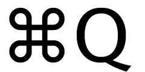

build-lists: true
slidenumbers: true

# [fit] Computers

^What is a computer, really?  It's a tool, but more specifically... 

---


^I suggest that it's an "if this, then that" machine, or alternatively,

---

# [fit]"When I say X, please do Y."

^a "when I say X, please do Y" machine. For example,

___


^When I double-click on a file, open it.
___


^"When I click a hyperlink, take me to that web page/email/Spotify song."
___


^"When I press command+Q, quit the program I'm in."
___


^"When I press this, turn off the sound."
___


^"When I go to `http://vpr.net`, show me some high-quality journalism."
___


^Programming, in Python or any other programming language, is the same.  (That's Guido von Rossum, by the way, inventor of Python.)

---
# [fit]"When I say X, please do Y."

---


```python
"donald trump elected president of cuba".title()
'Donald Trump Elected President Of Cuba'
```
"When I say `str.title()`, change my string to be in title case."

^Anyone have a Mac or a computer with Python on it?  You can follow along if you want.

---
# [fit]\(`string` is programming for "text"\)

---


```python
article_title = "donald trump elected president of cuba".title()
```
"When I say `x = something`, store `something` in the `variable` named `x`."

---

# [fit]=

^fun fact: this is an "assignment operator"

---


```python
print(article_title)
'Donald Trump Elected President Of Cuba'
```

"When I say `print(x)`, print whatever's stored in the variable `x`."

---


```python
corrected_article_title = article_title.replace('Of', 'of')
```

"When I say `str.replace(something, something_else)`, replace all instances of `something` in a string with `something_else`."


^`something` and `something_else` here are placeholders.

---


```python
corrected_article_title = article_title.replace('Of', 'of')
```

"When I say `str.replace(something, something_else)`, replace all instances of `something` in a string with `something_else`."

```python
print(corrected_article_title)
'Donald Trump Elected President of Cuba'
```

---
# [fit]Language

^Programming languages are truly languages, with their own syntax, and close analogs to structures found in spoken languages.

--- 
# [fit]Functions ≈ Verbs

^Functions are basically verbs. We already met a function...

--- 
# [fit]`print()`

^`print` is a built-in function that comes 'for free' with Python.  It prints any string that is 'fed' to it between the parentheses.

--- 

# [fit]`a_function(an_argument)`

^The things we "feed" to a function are called "arguments".  There can be zero or more.

---

# [fit]`function_call()`

^When we type a function's name followed by parentheses, we are "calling" or "invoking" it.

--- 
# [fit]Methods ≈ Functions

^Methods are verbs too.  They just live inside of objects; there's no difference between them and functions other than that.  We met a couple of these already:

---
# String Methods


```python
str.replace()
str.title()
...a bunch more
```

^We say these are string methods, because they're methods (or functions) that live inside of the built-in string object.  

---


\(A string object is just another way of saying a string. You can make a string object by surrounding some characters with "", as we did a few slides ago.\)

---

# [fit]`def`

^We can make our own functions!

---


```python
def ellipses_not(some_string):
    print(some_string + "... not!")
```

^Anyone want to guess what this does?  Anyone want to guess how to use it?

---


```python
ellipses_not(article_title)
'Donald Trump Elected President of Cuba... not!'
```

^Anyone want to guess how to fix the "not!"s case?

---

```python
def ellipses_not(some_string):
    print(some_string + "... Not!")
```

---

```python
def ellipses_not(some_string):
    print(some_string + "... Not!")
```

or

```python
def ellipses_not(some_string, make_titlecase):
    if make_titlecase == True:
        print(some_string + "... Not!")
    else:
        print(some_string + "... not!")
```

---

# ==

^fun fact: this is called the comparison operator.

---

# [fit] =

^what's this called again?

---

# [fit] ==

^and this?