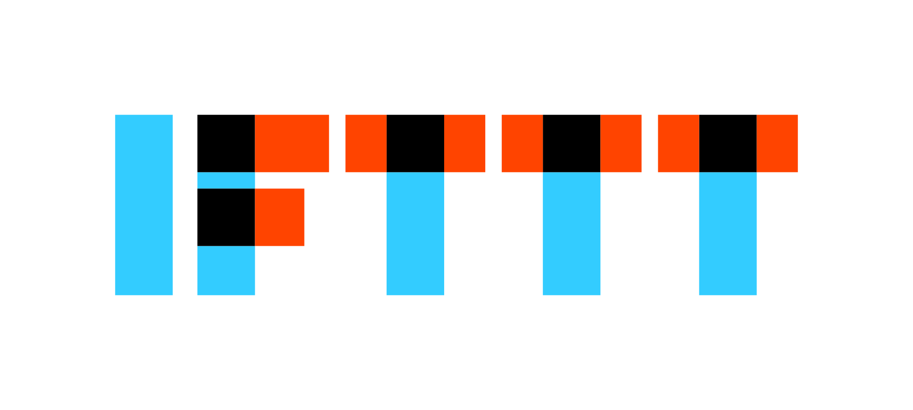
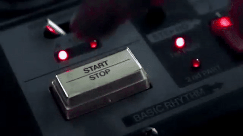

build-lists: true
# [fit] Computers

^What is a computer, really?  It's a tool, but more specifically... 

---

^I suggest that it's an "if this, then that" machine, or alternatively,

---

^a "when I say X, please do Y" machine.

---

# [fit]"When I say X, please do Y."

^For example,

___

# "When I say X, please do Y."

- "When I double-click on a file, open it."

- "When I click a hyperlink, take me to that web page/email/Spotify song."

- "When I press command+Q, quit the program I'm in."

- "When I press , turn off the sound."

- "When I go to `https://vpr.net`, show me some high-quality news."